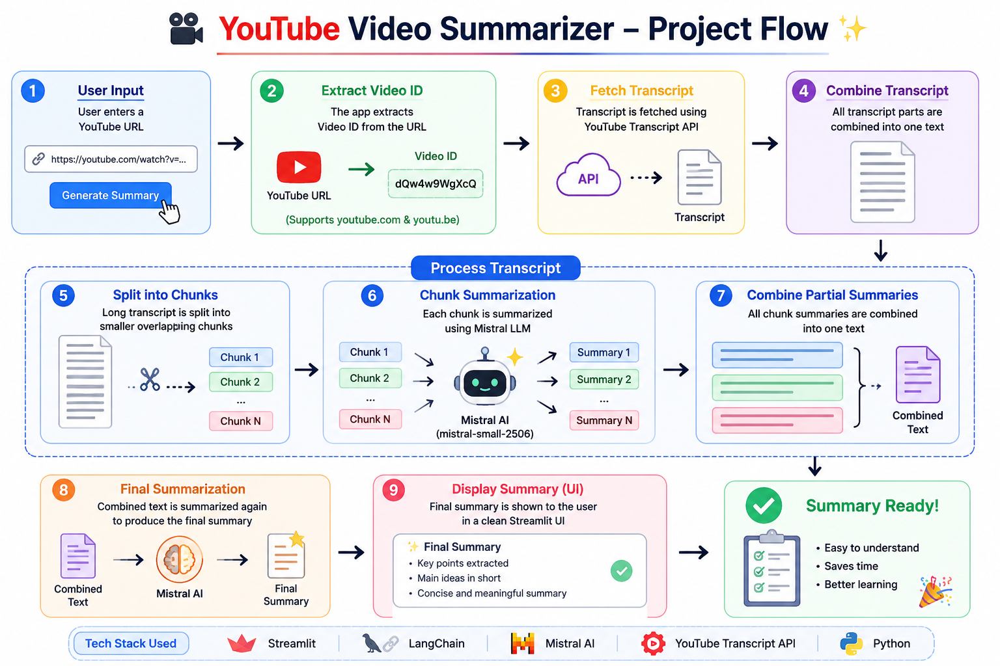

# 🎥 YouTube Video Summarizer

An AI-powered YouTube Video Summarizer built using **Streamlit**, **LangChain**, **Mistral AI**, and **YouTube Transcript API**.

Paste any YouTube video URL and get a concise AI-generated summary instantly.

---

## 🚀 Features

* Extracts transcript directly from YouTube videos
* Supports both:

  * `youtube.com`
  * `youtu.be`
* Splits long transcripts into chunks
* Generates chunk summaries
* Combines them into one final summary
* Clean Streamlit interface

---

## 🛠️ Tech Stack

* Python
* Streamlit
* LangChain
* Mistral AI
* YouTube Transcript API
* Recursive Text Splitting

---

## 📂 Project Structure

```plaintext
youtube-video-summarizer/
│
├── app.py
├── requirements.txt
├── .env
├── README.md
```

---
### Architecture
 
## ⚙️ Installation

### Clone Repository

```bash
git clone YOUR_REPO_URL
cd youtube-video-summarizer
```

### Create Virtual Environment

```bash
python -m venv .venv
```

Activate environment:

Windows:

```bash
.venv\Scripts\activate
```

Mac/Linux:

```bash
source .venv/bin/activate
```

### Install Dependencies

```bash
pip install -r requirements.txt
```

---

## 🔑 Environment Variables

Create `.env`

```env
MISTRAL_API_KEY=your_api_key
```

---

## ▶️ Run Application

```bash
streamlit run app.py
```

Open browser:

```plaintext
http://localhost:8501
```

---

## 📌 How It Works

1. User enters YouTube URL
2. App extracts video ID
3. Transcript is fetched
4. Transcript is split into chunks
5. Mistral AI summarizes each chunk
6. Final summary is generated

---

## Example Input

```plaintext
https://www.youtube.com/watch?v=VIDEO_ID
```

## Example Output

```plaintext
• Main topic explained
• Important insights extracted
• Final concise summary generated
```

---

## Future Improvements

* Multi-language summaries
* Export summary as PDF
* Summary history
* Video metadata support
* Download summary option

---

## Author

Khushwant Singh Rajat
